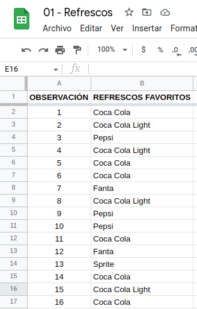
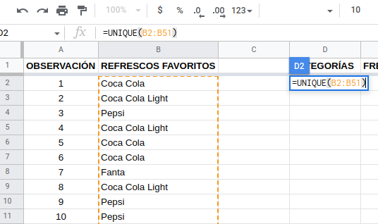
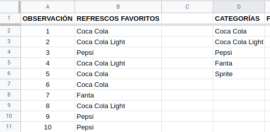
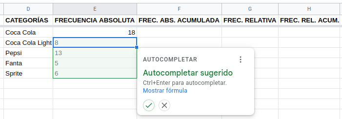
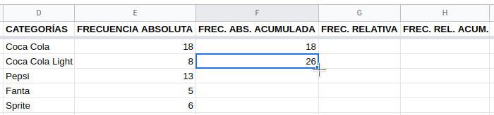
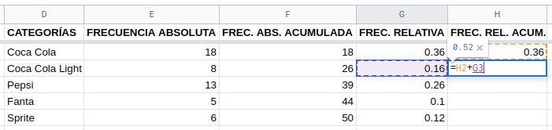
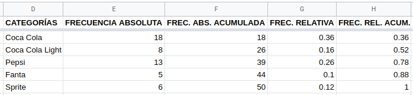

## Introducción

Dividiremos la Estadística en dos ramas por el momento. En primera instancia, es necesario recopilar, organizar, resumir y presentar los datos; de esto se encarga la __Estadística Descriptiva__. Por otro lado, se desea extender las propiedades de la muestra hacia la población, mediante inferencias que permitan comprender mejor su comportamiento e incluso pronosticarlo; esa es la función de la __Estadística Inferencial__. Trabajemos entonces con la primera, arrancando con la organización, resumen y presentación de los resultados. La parte de la recopilación la dejamos para otro apartado, por lo que partiremos de datos ya disponibles. 

Cabe mencionar que a lo largo de esta unidad se mostrarán dos maneras de abordar los ejercicios con alguna aplicación informática: tanto con hojas de cálculo (Google Sheets o LibreOffice Calc) como con RStudio. Cada peculiaridad de dichas aplicaciones se abordará en su momento.

## Observaciones y variables

En Estadística manejamos el concepto de **observaciones** y **variables** como los valores que pueden tomar las características que estamos analizando. Por ejemplo, supongamos que estamos midiendo la estatura de 25 estudiantes que pertenecen a un grupo de cuarto cuatrimestre: la variable es la característica "estatura" y tendremos 25 observaciones, ya que se corresponden con cada una de las 25 mediciones obtenidas. 

Es importante mencionar que en cuanto a las variables, existen un par de tipos de ellas: **cualitativas** (nominales y ordinales) y **cuantitativas** (numéricas). Entre las nominales reconocemos valores compuestos únicamente por nombres o etiquetas, es decir, solo palabras; por otro lado, las ordinales aceptan números, pero solo como datos ordenados de menor a mayor en cuanto a jerarquía. Entre las ordinales tenemos números como *primero* o *segundo*. Son números, pero no tiene sentido realizar operaciones con estos (sumar el primero con el tercer lugar no es coherente). Por último, las variables numéricas son eso, números que pueden repetirse más o menos, pero que sí se pueden realizar operaciones matemáticas con ellos.

## Resúmenes estadísticos

Estudiaremos tres formas de resumir los datos: tabular, gráfica y numérica. La forma tabular consiste en ordenar y organizar los datos en forma de tabla, tomando como referencia las frecuencias de aparición de cada observación; la forma gráfica implica construir un diagrama a partir de la tabla previamente elaborada y por último, el resumen numérico requiere que se hagan ciertos cálculos que incluyan todas las observaciones. Como cabe esperarse, la última solo se aplica a variables cuantitativas, por lo tanto, la dejaremos para el final. 

### Resumen tabular nominal

Para mostrar cómo elaborar un resumen tabular comenzaremos trabajando con variables nominales (aplica lo mismo para ordinales). Este resumen le llamamos **Tabla de frecuencias** y consiste básicamente en organizar los datos enumerándolos sin que se repitan, luego contar cuántas veces se repite cada dato armando la frecuencia absoluta de dicho dato y a partir de la misma obtenemos la frecuencia relativa. Esta última se obtiene dividiendo la frecuencia absoluta correspondiente entre el número total de observaciones. Quizás se sienta esta explicación algo apresurada, pero se puede justificar diciendo que solo es necesario saber sobre qué hablamos, pues la manera de hacerlo le corresponde a las aplicaciones informáticas. Procedamos a ello.

#### Tabla de frecuencias con hojas de cálculo

Tomemos el conjunto de datos que se encuentra en la hoja de cálculo de *Google Sheets* accesible mediante el siguiente [enlace](https://docs.google.com/spreadsheets/d/1aNo_5-bE7Y3T9lAc0wwYZi0rVYFjHm7DJyQRpmMA8JM/edit?usp=sharing). Si se trabajará dentro de *Sheets* y se accede con una cuenta de *Gmail*, debe realizarse una copia del archivo debido a que se provee sin posibilidad de ser editado. Si se accede sin dicha cuenta o si se trabajará con *Calc* o *Excel*, debe descargarse el archivo en el formato adecuado: *ods* o *xlsx*, respectivamente.

Contando con la cuenta de *gmail* y con la copia realizada, observemos un poco nuestros datos: son 50 observaciones ubicadas solo en la columna B, en el intervalo *B2:B51*. Son las marcas de refrescos escogidas como favoritas por 50 personas encuestadas. 

```{r, out.width='50%', fig.align='center', echo = FALSE}

```

Toca ahora que procedamos con el conteo de cuántas veces se repite cada marca. Para ello, nos colocamos en la celda *D1* y creamos el encabezado de la columna **CATEGORÍAS**, bajamos a la celda *D2* y escribimos la siguiente fórmula:

```
=UNIQUE(B2:B51)
```

```{r, out.width='100%', fig.align='center', echo = FALSE}

```

Al dar *Enter* nos devolverá los resultados en tantas celdas como sea necesario, siendo las categorías mostradas a continuación:

```{r, out.width='100%', fig.align='center', echo = FALSE}

```

Crearemos los siguientes encabezados para tener listas todas las columnas de una tabla de frecuencias típica: **Frecuencia Absoluta**, **Frecuencia Absoluta Acumulada**, **Frecuencia Relativa** y **Frecuencia Relativa Acumulada**. Toca ahora contar las frecuencias, utilizando la fórmula de conteo condicional, la cual requiere dos argumentos: el intervalo, que consiste en los datos originales, ubicados en el intervalo *B2:B51*; y el criterio, el cual se corresponde con las categorías obtenidas con la fórmula anterior (*D2:D6*). Nos ubicamos en la celda *E2* y escribimos la fórmula

```
=CONTAR.SI(B2:B51,D2:D6)
```

```{r, out.width='100%', fig.align='center', echo = FALSE}
knitr::include_graphics(path = "images/GoogleSheets004.png")
```

*Sheets* nos sugerirá que le permitamos autocompletar la fórmula, aceptando el mensaje aparecido. Así tendremos ya nuestra frecuencia absoluta.

```{r, out.width='100%', fig.align='center', echo = FALSE}

```

La frecuencia absoluta acumulada se calcula como sigue. 

- En la celda *F2* copiamos el contenido de la celda *E2*.
- En la celda *F3* utilizamos la función 

```
=F2+E3
```

En esta ocasión rechazamos la sugerencia de *Sheets* y obtendremos el acumulado de las primeras dos categorías: 26. El siguiente paso implica posar el cursor en el pequeño cuadrado que se encuentra en la parte inferior derecha de la celda, hasta que cambie a una cruz de brazos delgados. Cuando esto pase, toca dar clic en dicho cuadrado y sin soltarlo, arrastrar hasta la celda *F6*.

```{r, out.width='100%', fig.align='center', echo = FALSE}

```

Pongamos atención en la celda *F6*. Nos indica la totalidad de observaciones (50 en este caso), el cual es un número que estaremos utilizando en lo subsecuente. Ubiquémonos ahora en la celda *G2* e introduzcamos la función

```{}
=E2/50
```

La frecuencia relativa es un porcentaje que calculamos dividiendo la frecuencia absoluta entre el número de observaciones. Aceptamos la sugerencia de *Sheets* y tendremos ya completa la columna. 

```{r, out.width='100%', fig.align='center', echo = FALSE}
knitr::include_graphics(path = "images/GoogleSheets007.png")
```

Finalicemos la tabla colocándonos en la celda *H2* y copiando la frecuencia relativa correspondiente (0.36) ahí. Enseguida bajamos a la celda *H3* y escribimos la función

```{}
=H2+G3
```

```{r, out.width='100%', fig.align='center', echo = FALSE}

```

De nuevo rechazamos la sugerencia y aplicamos el mismo procedimiento de arrastrar la fórmula mediante el cuadrado inferior y obtendremos el acumulado total, que será de 1. Hemos terminado la **tabla de frecuencias**. 

```{r, out.width='100%', fig.align='center', echo = FALSE}

```

