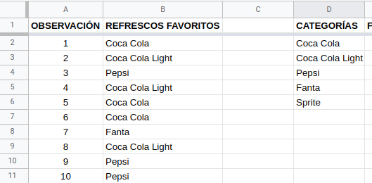
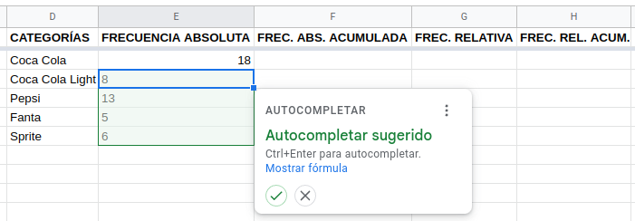

## Introducción

Dividiremos la Estadística en dos ramas por el momento. En primera instancia, es necesario recopilar, organizar, resumir y presentar los datos; de esto se encarga la __Estadística Descriptiva__. Por otro lado, se desea extender las propiedades de la muestra hacia la población, mediante inferencias que permitan comprender mejor su comportamiento e incluso pronosticarlo; esa es la función de la __Estadística Inferencial__. Trabajemos entonces con la primera, arrancando con la organización, resumen y presentación de los resultados. La parte de la recopilación la dejamos para otro apartado, por lo que partiremos de datos ya disponibles. 

Cabe mencionar que a lo largo de esta unidad (y en este sitio) se mostrará la manera de abordar problemas estadísticas utilizando las hojas de cálculo de Google, llamadas Sheets. Si se desea trabajar con LibreOffice Calc, se puede acceder [aquí](UC1.html). Si se desea abordar el contenido desde el enfoque de **R** o **RStudio**, el acceso está [aquí](UR1.html). Cada peculiaridad de dichas aplicaciones se abordará en su respectivo momento.

## Observaciones y variables

En Estadística manejamos el concepto de **observaciones** y **variables** como los valores que pueden tomar las características que estamos analizando. Por ejemplo, supongamos que estamos midiendo la estatura de 25 estudiantes que pertenecen a un grupo de cuarto cuatrimestre: la variable es la característica "estatura" y tendremos 25 observaciones, ya que se corresponden con cada una de las 25 mediciones obtenidas. 

Es importante mencionar que en cuanto a las variables, existen un par de tipos de ellas: **cualitativas** (nominales y ordinales) y **cuantitativas** (numéricas). Entre las nominales reconocemos valores compuestos únicamente por nombres o etiquetas, es decir, solo palabras; por otro lado, las ordinales aceptan números, pero solo como datos ordenados de menor a mayor en cuanto a jerarquía. Entre las ordinales tenemos números como *primero* o *segundo*. Son números, pero no tiene sentido realizar operaciones con estos (sumar el primero con el tercer lugar no es coherente). Por último, las variables numéricas son eso, números que pueden repetirse más o menos, pero que sí se pueden realizar operaciones matemáticas con ellos.

## Resúmenes estadísticos

Estudiaremos tres formas de resumir los datos: tabular, gráfica y numérica. La forma tabular consiste en ordenar y organizar los datos en forma de tabla, tomando como referencia las frecuencias de aparición de cada observación; la forma gráfica implica construir un diagrama a partir de la tabla previamente elaborada y por último, el resumen numérico requiere que se hagan ciertos cálculos que incluyan todas las observaciones. Como cabe esperarse, la última solo se aplica a variables cuantitativas, por lo tanto, la dejaremos para el final. 

### Resumen tabular nominal

Para mostrar cómo elaborar un resumen tabular comenzaremos trabajando con variables nominales (aplica lo mismo para ordinales). Este resumen le llamamos **Tabla de frecuencias** y consiste básicamente en organizar los datos enumerándolos sin que se repitan, luego contar cuántas veces se repite cada dato armando la frecuencia absoluta de dicho dato y a partir de la misma obtenemos la frecuencia relativa. Esta última se obtiene dividiendo la frecuencia absoluta correspondiente entre el número total de observaciones. Quizás se sienta esta explicación algo apresurada, pero se puede justificar diciendo que solo es necesario saber sobre qué hablamos, pues la manera de hacerlo le corresponde a las aplicaciones informáticas. Procedamos a ello.

#### Tabla de frecuencias

Tomemos el conjunto de datos que se encuentra en la hoja de cálculo de *Google Sheets* accesible mediante el siguiente [enlace](https://docs.google.com/spreadsheets/d/1aNo_5-bE7Y3T9lAc0wwYZi0rVYFjHm7DJyQRpmMA8JM/edit?usp=sharing). Si se trabajará dentro de *Sheets* y se accede con una cuenta de *Gmail*, debe realizarse una copia del archivo debido a que se provee sin posibilidad de ser editado. Si se accede sin dicha cuenta o si se trabajará con *Calc* o *Excel*, debe descargarse el archivo en el formato adecuado: *ods* o *xlsx*, respectivamente.

Contando con la cuenta de *gmail* y con la copia realizada, observemos un poco nuestros datos: son 50 observaciones ubicadas solo en la columna B, en el intervalo *B2:B51*. Son las marcas de refrescos escogidas como favoritas por 50 personas encuestadas. 

```{r, out.width='50%', fig.align='center', echo = FALSE}
knitr::include_graphics("images/GoogleSheets001.png")
```

Toca ahora que procedamos con el conteo de cuántas veces se repite cada marca. Para ello, nos colocamos en la celda *D1* y creamos el encabezado de la columna **CATEGORÍAS**, bajamos a la celda *D2* y escribimos la siguiente fórmula:

```
=UNIQUE(B2:B51)
```

```{r, out.width='100%', fig.align='center', echo = FALSE}
knitr::include_graphics("images/GoogleSheets002.png")
```

Al dar *Enter* nos devolverá los resultados en tantas celdas como sea necesario, siendo las categorías mostradas a continuación:

```{r, out.width='100%', fig.align='center', echo = FALSE}

```

Crearemos los siguientes encabezados para tener listas todas las columnas de una tabla de frecuencias típica: **Frecuencia Absoluta**, **Frecuencia Absoluta Acumulada**, **Frecuencia Relativa** y **Frecuencia Relativa Acumulada**. Toca ahora contar las frecuencias, utilizando la fórmula de conteo condicional, la cual requiere dos argumentos: el intervalo, que consiste en los datos originales, ubicados en el intervalo *B2:B51*; y el criterio, el cual se corresponde con las categorías obtenidas con la fórmula anterior (*D2:D6*). Nos ubicamos en la celda *E2* y escribimos la fórmula

```
=CONTAR.SI(B2:B51,D2:D6)
```

```{r, out.width='100%', fig.align='center', echo = FALSE}
knitr::include_graphics(path = "images/GoogleSheets004.png")
```

*Sheets* nos sugerirá que le permitamos autocompletar la fórmula, aceptando el mensaje aparecido. Así tendremos ya nuestra frecuencia absoluta.

```{r, out.width='100%', fig.align='center', echo = FALSE}

```

La frecuencia absoluta acumulada se calcula como sigue. 

- En la celda *F2* copiamos el contenido de la celda *E2*.
- En la celda *F3* utilizamos la función 

```
=F2+E3
```

En esta ocasión rechazamos la sugerencia de *Sheets* y obtendremos el acumulado de las primeras dos categorías: 26. El siguiente paso implica posar el cursor en el pequeño cuadrado que se encuentra en la parte inferior derecha de la celda, hasta que cambie a una cruz de brazos delgados. Cuando esto pase, toca dar clic en dicho cuadrado y sin soltarlo, arrastrar hasta la celda *F6*.

```{r, out.width='100%', fig.align='center', echo = FALSE}
knitr::include_graphics("images/GoogleSheets006.png")
```

Pongamos atención en la celda *F6*. Nos indica la totalidad de observaciones (50 en este caso), el cual es un número que estaremos utilizando en lo subsecuente. Ubiquémonos ahora en la celda *G2* e introduzcamos la función

```{}
=E2/50
```

La frecuencia relativa es un porcentaje que calculamos dividiendo la frecuencia absoluta entre el número de observaciones. Aceptamos la sugerencia de *Sheets* y tendremos ya completa la columna. 

```{r, out.width='100%', fig.align='center', echo = FALSE}
knitr::include_graphics(path = "images/GoogleSheets007.png")
```

Finalicemos la tabla colocándonos en la celda *H2* y copiando la frecuencia relativa correspondiente (0.36) ahí. Enseguida bajamos a la celda *H3* y escribimos la función

```{}
=H2+G3
```

```{r, out.width='100%', fig.align='center', echo = FALSE}
knitr::include_graphics("images/GoogleSheets008.png")
```

De nuevo rechazamos la sugerencia y aplicamos el mismo procedimiento de arrastrar la fórmula mediante el cuadrado inferior y obtendremos el acumulado total, que será de 1. Hemos terminado la **tabla de frecuencias**. 

```{r, out.width='100%', fig.align='center', echo = FALSE}
knitr::include_graphics("images/GoogleSheets009.png")
```

Es fácil darse cuenta que la *Coca Cola* es el refresco más preferido, al menos para nuestros encuestados. Numéricamente hablando, la preferencia por esta marca es del 36%, dato que se extrae de la columna de las frecuencias relativas. Recordemos que estas frecuencias son porcentajes, así que solo las multiplicamos por 100 y ya podemos escribirlas como tales. La segunda marca preferida es *Pepsi* con un 26% y la menos preferida es *Fanta*, que solo acumuló el 10% de los encuestados.

### Resumen gráfico nominal

Contrario a la costumbre popular, el gráfico recomendado solo para datos nominales es el aparentemente omnipresente diagrama de pastel, de sectores, circular o de pay. Este sencillo pero problemático gráfico no debe utilizarse para datos numéricos, debido al inconveniente de la mala percepción humana ante proporciones circulares.

#### Gráfico circular

Procedamos a construir un diagrama circular utilizando *Google Sheets*. Partamos de los [datos](https://docs.google.com/spreadsheets/d/1aNo_5-bE7Y3T9lAc0wwYZi0rVYFjHm7DJyQRpmMA8JM/edit?usp=sharing) de las marcas de refrescos que ya utilizamos en el apartado de la tabla de frecuencias. Recordemos que debemos crear una copia si ya contamos con cuenta *gmail* o descargarlos para poder utilizarlos en cualquier aplicación de hoja de cálculo.

Seleccionamos todos las celdas que contienen datos en la columna *B*, ya sea mediante el ratón o bien, nos ubicamos en la celda *B1* y presionamos la combinación de teclas *Ctrl + Shift + Flecha Abajo*. Enseguida nos dirigimos al menú `Insertar -> Gráfico` y nos aparecerá en automático el gráfico de pastel. En caso de que no, debemos asegurarnos de que el panel que aparecerá a la izquierda tiene las siguientes opciones seleccionadas:

```{r, out.width='50%', fig.align='center', echo = FALSE}
knitr::include_graphics("images/GoogleSheets010.png")
```

El gráfico generado debería verse más o menos como sigue:

```{r, out.width='50%', fig.align='center', echo = FALSE}
knitr::include_graphics("images/GoogleSheets011.png")
```

Aunque por alguna razón nos pueda parecer atractivo utilizar un diagrama tridimensional, es mejor evitarlo. En gráficos, se debe procurar ser algo minimalistas. Y listo, ya podemos presentar nuestros datos resumidos y reiterar que Coca-Cola es el refresco más preferido, al menos para nuestros encuestados.

### Resumen tabular numérico

Cuando se desee obtener un resumen en forma de tabla para datos cuantitativos, se utiliza la distribución de frecuencias, la cual consiste de un cierto número de clases y rangos que las definen, llamados límites de clase. Nos remitimos a contar cuántas veces encontramos datos dentro de esos límites y es lo que colocaremos en las frecuencias. Comencemos con la construcción de una distribución de frecuencias en **Sheets**.

#### Distribución de frecuencias

Arranquemos con nuestro conjunto de datos, al cual podemos acceder desde este [enlace](https://docs.google.com/spreadsheets/d/1w06TbOPyR4EG50ttYeLAFp_Hlh_QQD0xnGO9KhX27j0/edit?usp=sharing). Recordemos que debemos hacer una copia del archivo para trabajar con él desde **Sheets** o descargarlo en el formato deseado. Nuestros datos consisten de dos columnas: el número de observaciones y las estaturas como tales. 

```{r, out.width='50%', fig.align='center', echo = FALSE}
knitr::include_graphics("images/GoogleSheets012.png")
```

Agregaremos unas cuantas columnas a nuestro conjunto. La primera será *Total de observaciones*, seguimos con *Mínimo*, *Máximo* y al final *Número de clases*. El siguiente paso consistirá en calcular los valores correspondientes a estas columnas, es decir, cuántas observaciones incluye nuestro conjunto, cuáles son los números mínimo y máximo y de cuántas categorías o *clases* construiremos nuestra distribución. Lo haremos con la hoja de cálculo. Comencemos en la celda *C2* con la fórmula

```{}
=CONTAR(B2:B51)
```

Nos pasamos a la celda *D2* y escribimos

```{}
=MIN(B2:B51)
```

Ahora en la celda *E2*

```{}
=MAX(B2:B51)
```

Así obtenemos casi toda la información necesaria para construir la distribución.

```{r, out.width='50%', fig.align='center', echo = FALSE}
knitr::include_graphics("images/GoogleSheets013.png")
```


Solo nos falta definir el *número de clases*. Existen varios criterios para hacerlo, entre ellos se encuentra la **Regla de Sturges**:

$$
k=1+log_2(n)
$$
En esta fórmula matemática la $n$ es el número de datos. Si la introducimos en *Sheets* usando la celda *C2* (donde contamos cuántos valores tenía nuestro conjunto) y el $2$ como argumentos

```{}
=1+LOG(C2,2)
```

nos arroja como resultado $6.6438$.

Otro criterio es la **Regla de Scott**

$$
k=(2n)^{1/3}
$$

la cual podemos introducir en *Sheets* de la siguiente manera (recordando que $n$ es el número de datos):

```{}
=(2*C2)^(1/3)
```

Dando como resultado $4.6415$.

Un último criterio es uno más sencillo. A partir del número de datos calculamos su raíz cuadrada y nos quedamos con ese resultado como el número de clases.

$$
k=\sqrt{n}
$$
En la hoja de cálculo se obtiene mediante

```{}
=RAIZ(C2)
```

Obteniendo el resultado de $7.0710$.

Lo que debemos realizar ahora es decidir cuál número de clases seleccionar. Nos quedaremos en este caso con el resultado del primer criterio, es decir, con $7$ clases.

El siguiente paso es definir el tamaño o anchura de la clase, la cual puede seleccionarse al tanteo o bien, siguiendo una fórmula matemática bastante sencilla:

$$
l=\frac{R}{k}
$$

Donde $R$ es el rango, o sea, la diferencia entre el número máximo y el número mínimo y $k$ es el número de clases seleccionado. Podemos calcularlo en nuestra hoja de cálculo, tal como sigue:

```{}
=(E2-D2)/7
```

Así, sabemos que la anchura de clase es tentativamente $6$. 

Construyamos ahora la tabla que nos permitirá organizar nuestra distribución de frecuencias:

```{r, out.width='50%', fig.align='center', echo = FALSE}
knitr::include_graphics("images/GoogleSheets014.png")
```

Como podemos observar, ya comenzamos rellenando la columna *Clases*, enumerando desde $1$ hasta $7$, correspondiendo esto con el número de clases. También cabe mencionar que ya se incluyó el número más bajo en la columna que hemos llamado *Inferior*. Como ya también sabemos, la anchura de clase se quedó en $6$, por lo que comenzaremos a definir los límites de clase a partir de lo que ya conocemos. Nos colocaremos en la celda *H3* (justo debajo del $145$) e introduciremos la fórmula 

```{}
=H2+6
```

Esto nos dará un $151$ como resultado. Esta cantidad se corresponde con el límite inferior de la segunda clase, puesto que el límite inferior de la primera es $145$. Como podemos notar, la anchura de clase se refiere a la distancia entre los límites inferiores de dos clases contiguas, y no a la anchura de la clase en sí. Si arrastramos esta fórmula hasta la séptima clase (la celda *H8*), obtendremos los límites inferiores restantes. Ahora toca obtener los límites superiores, lo cual se obtiene colocando el cursor en *I2* y escribiendo la fórmula

```{}
=H2+5
```

Lo que hemos calculado es hasta donde debe llegar la primera clase, justo antes de tocar la segunda. Al ver que la segunda clase comienza en $151$, la primera debe llegar justo antes, es decir, hasta $150$. Arrastramos esta fórmula y obtenemos los límites superiores restantes.

```{r, out.width='50%', fig.align='center', echo = FALSE}
knitr::include_graphics("images/GoogleSheets015.png")
```


